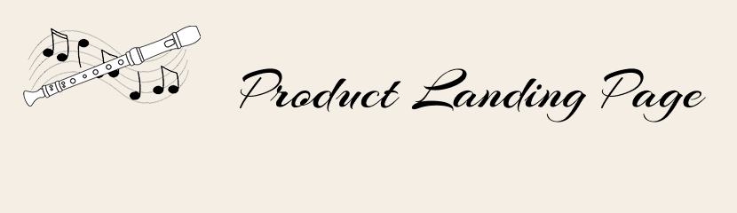

<h1 align="center">Лендинг</h1>

<h2 align="center">Описание</h2>

Эта страница была создана в качестве практического проекта для получения сертификата 
Responsive Web Design на freeCodeCamp.org.

<h2 align="center">Технологии</h2>

В этом проекте использовались: 
* HTML
* CSS

<h2 align="center">Дополнительно</h2>

Посмотреть страницу можно [здесь](https://natalielinen.github.io/product-landing-page/)

[Сертификат](https://www.freecodecamp.org/certification/natalielinen/responsive-web-design)
